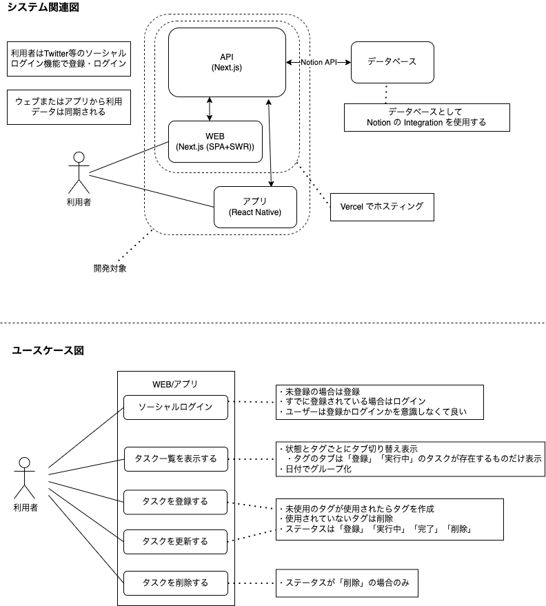
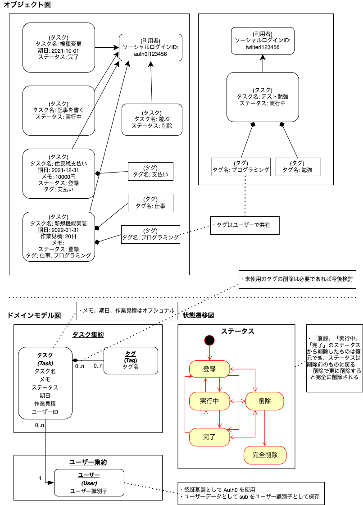

# ToDo List with DDD+CQRS

## Table of Contents

<!-- START doctoc generated TOC please keep comment here to allow auto update -->
<!-- DON'T EDIT THIS SECTION, INSTEAD RE-RUN doctoc TO UPDATE -->

Details

- [動作要件](#%E5%8B%95%E4%BD%9C%E8%A6%81%E4%BB%B6)
- [これはなに？](#%E3%81%93%E3%82%8C%E3%81%AF%E3%81%AA%E3%81%AB)
- [残タスク](#%E6%AE%8B%E3%82%BF%E3%82%B9%E3%82%AF)
- [開発](#%E9%96%8B%E7%99%BA)
  - [セットアップ](#%E3%82%BB%E3%83%83%E3%83%88%E3%82%A2%E3%83%83%E3%83%97)
  - [起動](#%E8%B5%B7%E5%8B%95)
  - [Linter](#linter)
  - [Type check](#type-check)
  - [Jest](#jest)
  - [Storybook](#storybook)
- [Author](#author)

*generated with [TOC Generator](https://github.com/technote-space/toc-generator)*

<!-- END doctoc generated TOC please keep comment here to allow auto update -->

## 動作要件

- Node.js >= 14
- yarn = 1.x

## これはなに？

`DDD`と`CQRS`で実装した`TODOリスト`

データベースとしてお試しで`Notion`の`Integration`を使用（遅いので別のDBも追加予定）

## 残タスク

- [ ] 一覧をタグやステータスでタブで分けて表示
- [ ] タスクを日付でグループ化して表示
- [ ] Vercel でホスティング
- [ ] アプリ実装
- [ ] etc.

## 開発

### セットアップ

1. パッケージのインストール
  * `yarn`
2. 環境変数の設定
  * `NOTION_SECRET`: `secret_xxxxxx`
  * `NOTION_PARENT_ID`: `親となるページID`
  * `SLACK_WEBHOOK_URL`: `エラー時にSlackを送信したい場合に設定するwebhook`
  * `NEXT_PUBLIC_AUTH0_CLIENT_ID`: `Auth0のClientID`
  * `NEXT_PUBLIC_AUTH0_DOMAIN`: `Auth0のDomain`
3. マイグレーション
  * `yarn migrate`

### 起動

`yarn dev`

http://localhost:3000/

### Linter

`yarn lint`

#### fix

`yarn lint:fix`

### Type check

`yarn typecheck`

### Jest

`yarn cover`

#### スナップショットの更新

`yarn cover:update`

### Storybook

`yarn sb`

## Author

[GitHub (Technote)](https://github.com/technote-space)  
[Blog](https://technote.space)
